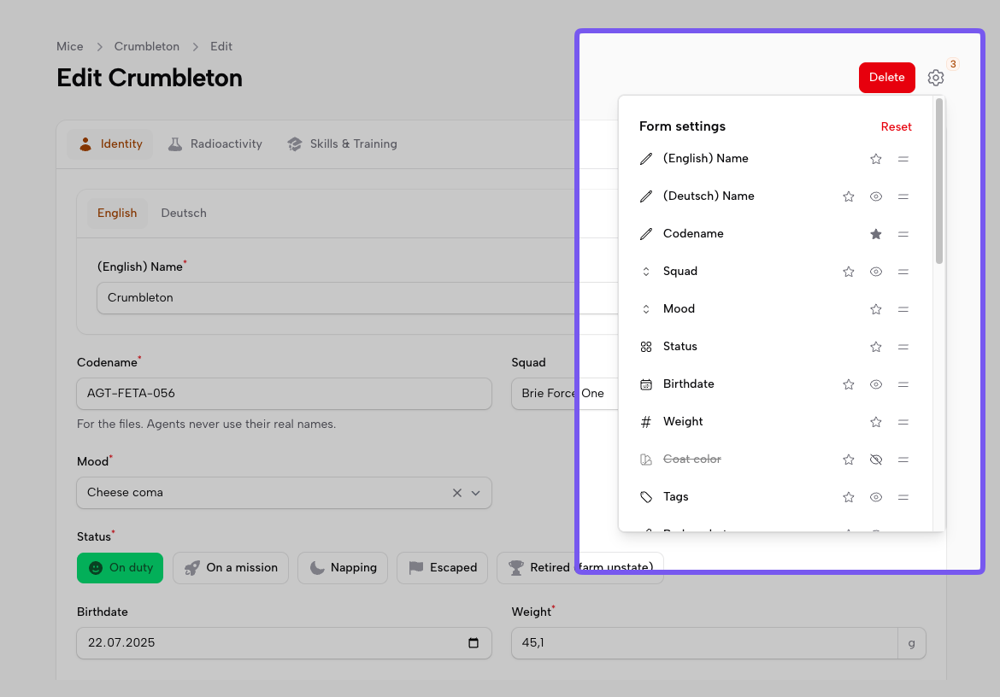

# formsettings-for-filament

> rule your forms

[](https://packagist.org/packages/blemli/formsettings-for-filament)[](https://github.com/blemli/formsettings-for-filament/actions?query=workflow%3Arun-tests+branch%3A5.x)[](https://packagist.org/packages/blemli/formsettings-for-filament)

A gear on your form pages that lets every user tune the form like the table column selector: reorder the tab order, hide optional fields, pick an autofocus entry point, and choose what the submit button does (save / save & next / save & back, `cmd+enter` included).



## Installation

```bash
composer require blemli/formsettings-for-filament
php artisan formsettings-for-filament:install   # publishes config + migration (only needed with persist())
```

## Usage

```php
use Blemli\FormSettings\FormSettingsPlugin;

$panel->plugin(
    FormSettingsPlugin::make()
        ->globally()   // gear on all Create/Edit pages …
        ->persist()    // … settings per user in the DB instead of the session
        ->presets()    // … named presets
        ->authorize('use-formsettings')   // … only for power users: bool, closure or gate ability (plays nice with Filament Shield)
);
```

Without `globally()`, opt single pages in with the `Blemli\FormSettings\Concerns\HasFormSettings` trait.
Uninstall cleanly with `php artisan formsettings:uninstall`.

## License

MIT — see [LICENSE](LICENSE.md).
