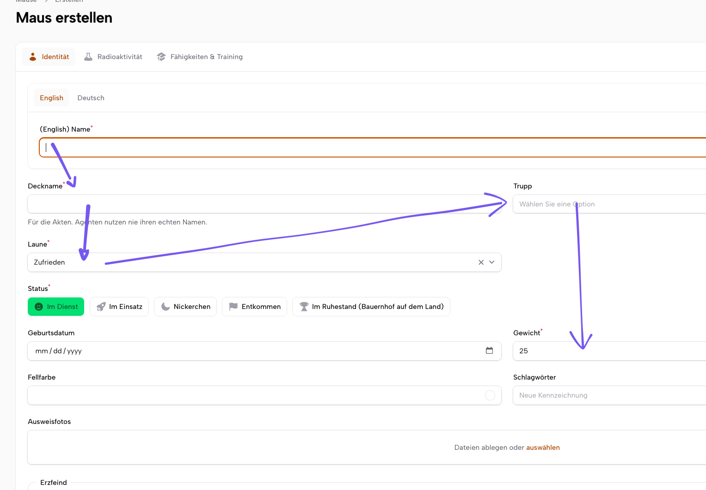

## predefined presets

allow ->predefined(resource,[field,[index(int), hidden(bool),entrypoint(bool)]])

Or sett it directly on the fields in the resource? Ideas?

## Interactive

The panel gets very crowded for big forms.

maybe instead of the reorder list we show interactive badges on the form fields (hide, entry point) and let the user draw a line from one to the next field which gives the order? would be very intuitive no?

could this be cool or unexpected?

put a dropdown on the formsettings which shows reset after 2h by default and can be changed to 12h 1 week, never. also it dissapears when the settings are on default.

it could also learn the average amount the settings are changed after and show a tip "auto reset after 2h?"

or just resetAfter(2h) or just revertOnMidnight()

https://filamentphp.com/docs/5.x/resources/creating-records#creating-another-record

Learn: 

1) should it suggest a preset if the usage pattern exactly matches it?
2) maybe add "you often start in tab xy. set as starting point?"

hide on certain pages?

->hideOnMobile()